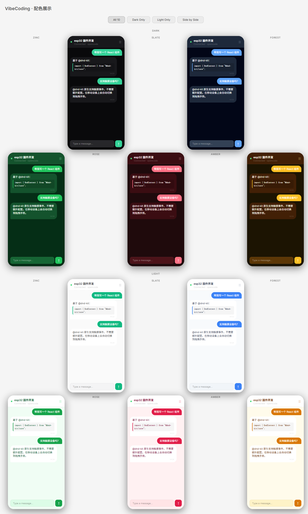

# VibeCoding

在手机上继续电脑 opencode 的对话。

```
手机 App ←──WSS──→ your-domain.com:443 (nginx) ──WS──→ 127.0.0.1:8766 (relay) ←──WSS──→ PC 客户端 → opencode
```

## 截图

<p align="center">
  
</p>

## 安装部署

### 1. 本地环境（Windows）

```powershell
scripts\setup.bat
```

自动完成：
- 检查 Node.js / Python
- `npm install`
- 生成 `config.json`（从模板）
- 生成 `client/.vibecoding-token`

装完后编辑 `config.json`，填入 relay 地址：

```json
{
  "relayUrl": "wss://你的域名.com/vibecoding/ws",
  "relayOrigin": "https://你的域名.com"
}
```

### 2. 中继服务器（Linux）

把项目传到服务器后执行：

```bash
bash scripts/setup-server.sh 你的域名.com
```

自动完成：
- 安装 Node.js
- 部署 relay 到 `/opt/vibecoding-relay/`
- 生成随机 Token
- 创建 systemd 服务并启动
- 配置 nginx WebSocket 代理
- 配置 fail2ban 防爆破

> 需要先配置好域名 SSL 证书（`certbot --nginx -d 你的域名.com`）。

### 3. 同步 Token

服务器运行后查看 token：

```bash
cat /opt/vibecoding-relay/tokens.env
```

把 `PC_TOKEN` 复制到本地 `client/.vibecoding-token`，`PHONE_TOKEN` 后面填到手机 App。

### 4. 运行 PC 客户端

```bash
node client/client.js
```

支持开机自启，见下方"开机自启"章节。

### 5. 编译安装 App

```powershell
npx expo prebuild --platform android
cd android
.\gradlew assembleRelease -PreactNativeArchitectures=arm64-v8a -x lintVitalAnalyzeRelease
```

APK 位置：`android/app/build/outputs/apk/release/app-release.apk`

手机安装后打开，设置页填入：
- **Relay URL**: `wss://你的域名.com/vibecoding/ws`
- **Token**: 服务器的 `PHONE_TOKEN`
- **Room ID**: `default`（与 PC 客户端一致）
- **Work Dir**: 你项目的路径

## 目录结构

```
vibecoding-app/
├── config.example.json       配置模板
├── config.json               实际配置（不提交 git）
├── app/                      Expo Android 应用
├── client/                   PC 客户端
├── relay/                    中继服务器
├── scripts/
│   ├── setup.bat             本地一键配置
│   ├── setup-server.sh       服务器一键部署
│   └── vibecoding-client-wrapper.ps1  守护脚本
├── assets/
└── README.md
```

## 认证机制

Token 通过 WebSocket 子协议（`Sec-WebSocket-Protocol`）传输，不经过 URL。

| 角色 | Token 来源 |
|------|-----------|
| PC 端 | `RELAY_TOKEN` 环境变量 或 `client/.vibecoding-token` 文件 |
| Phone 端 | App 设置页手动输入（AsyncStorage 自动保存） |

连接 URL（不含 Token）：`wss://你的域名.com/vibecoding/ws/{room}/{role}`

## 配置

```json
{
  "relayUrl": "wss://your-domain.com/vibecoding/ws",
  "relayOrigin": "https://your-domain.com",
  "relayHost": "127.0.0.1",
  "relayPort": 8766,
  "compactPython": "python",
  "opencodeBinWsl": "/home/YOU/.npm-global/bin/opencode",
  "statsDbPaths": ["/home/YOU/.local/share/opencode/opencode.db"],
  "allowedDirs": ["/home/YOU/projects/"]
}
```

环境变量优先于配置文件。

## PC 客户端

### 环境变量

| 变量 | 默认值 | 说明 |
|------|--------|------|
| `ROOM` | `default` | 房间名 |
| `RELAY_URL` | `config.relayUrl` | 中继地址 |
| `RELAY_TOKEN` | 读 `.vibecoding-token` 文件 | PC 认证 token |
| `OPENDCODE_BIN` | 自动检测 | opencode 可执行文件路径 |
| `OPENDCODE_MODE` | `json` | 输出格式 |
| `COMPACT_PYTHON` | `config.compactPython` | Python 解释器 |

### 目录白名单

编辑 `config.json` 中的 `allowedDirs` 数组，支持 Windows、WSL、Linux 路径。

### 开机自启（Windows）

```powershell
$action = New-ScheduledTaskAction -Execute "powershell.exe" `
  -Argument "-WindowStyle Hidden -ExecutionPolicy Bypass -File `"C:\vibecoding-app\scripts\vibecoding-client-wrapper.ps1`""
$trigger = New-ScheduledTaskTrigger -AtLogon
$settings = New-ScheduledTaskSettingsSet -AllowStartIfOnBatteries -DontStopIfGoingOnBatteries
Register-ScheduledTask -TaskName "vibecoding-client" -Action $action -Trigger $trigger -Settings $settings -RunLevel Highest
```

守护脚本支持崩溃指数退避（5s → 最大 60s）。

### Linux

直接运行，opencode 需在 PATH 中。`/compact` 命令不可用（依赖 Windows 终端自动化）。

### 网络恢复

客户端启用 TCP keepalive（15s）检测半开连接，配合 relay 消息缓存实现：

- 前台断线：1 秒内自动重连，保留当前对话
- 锁屏/后台断线：回到前台立即自动重连，保留对话
- 手动 Disconnect：不会自动重连，需重新点 Connect

### 特殊命令

| 命令 | 说明 |
|------|------|
| `/model provider/model` | 切换模型 |
| `/variant high/minimal/max` | 推理强度 |
| `/compact` | 压缩对话（仅 Windows） |
| `!!restart` | 重启 PC 客户端 |

### Token 统计

每次回复后显示：`c=上下文 o=输出 r=思考` 以及模型名称。

## 中继服务器

使用 `scripts/setup-server.sh` 一键部署后，systemd 管理。支持离线消息缓存（手机断线时自动缓冲最多 500 条，溢出丢弃最早消息，重连后补发）。

### 手动部署参考

```nginx
location /vibecoding/ws {
    proxy_pass http://127.0.0.1:8766/;
    proxy_http_version 1.1;
    proxy_set_header Upgrade $http_upgrade;
    proxy_set_header Connection upgrade;
    proxy_set_header Host $host;
    proxy_set_header X-Real-IP $remote_addr;
    proxy_set_header X-Forwarded-For $proxy_add_x_forwarded_for;
    proxy_set_header X-Forwarded-Proto $scheme;
    proxy_read_timeout 86400s;
    proxy_send_timeout 86400s;
}
```

## App

### 编译

```powershell
npx expo prebuild --platform android
cd android
.\gradlew assembleRelease -PreactNativeArchitectures=arm64-v8a -x lintVitalAnalyzeRelease
```

APK 位置：`android/app/build/outputs/apk/release/app-release.apk`

### 连接

设置页填入 Relay URL / Token / Room ID / Work Dir。自动保存，换服务器无需重新编译。

### 显示

- V2 Bold Modern UI：聊天气泡（用户彩色气泡 / 助手卡片气泡）
- 5 套配色（Zinc / Slate / Forest / Rose / Amber），每套含深色/浅色模式
- 自定义颜色（背景/文字/强调/次要文字）和聊天背景图
- 代码块蓝色左边框，表格自动换行适配屏幕
- 处理中显示 Thinking... 旋转动画
- 首次连接自动加载最近 30 轮历史（可关闭）
- 设置面板内嵌连接配置、主题切换、颜色自定义

## 安全

| 措施 | 详情 |
|------|------|
| 传输加密 | WSS（TLS）全链路 |
| Relay 监听 | 仅 127.0.0.1 |
| 角色隔离 | PC / Phone 独立 Token |
| Token 验证 | `timingSafeEqual` 防时序攻击 |
| 速率限制 | 每房间 30 条/10s，每 IP 20 次连接/分钟 |
| 消息缓存 | 手机离线时 relay 缓存 PC→phone 消息（最多 100 条），重连后补发 |
| 目录白名单 | 限制可访问路径 |

## 安全说明与免责

⚠️ **本软件按现状提供，无任何保证。使用本软件产生的任何后果由用户自行承担。**

| 风险 | 说明 |
|------|------|
| **opencode 无沙箱隔离** | 🔴 opencode 以你的用户权限运行，**可读写磁盘上任何文件**，不受目录白名单限制。目录白名单仅作用于 VibeCoding 客户端的项目选择界面，opencode 本身没有沙箱。误操作或被恶意指令诱导可能导致数据丢失或系统损坏。 |
| Token 明文存储 | PC: `client/.vibecoding-token` 文件；Phone: AsyncStorage。设备安全由用户自行保障。 |
| 无证书锁定 | App 信任系统 CA。如果设备被安装了恶意 CA 证书，通信可能被中间人攻击。 |
| Relay 可见明文消息 | TLS 在 nginx 终止，relay 能读到全部对话内容。请部署在可信环境。 |
| 白名单仅客户端侧 | 可被绕过，服务端无强制。 |
| Token 无自动轮换 | Token 泄露后永久有效，需手动更换。 |

**用户自行承担**：中继服务器安全、Token 保管、设备安全、以及 opencode 对文件系统的操作后果。作者不对滥用、数据泄露、或文件损坏承担责任。

**合法使用**：本软件仅用于合法的软件开发和编程辅助。使用者不得将其用于任何违法目的，包括但不限于生成恶意代码、未经授权的系统入侵、或侵犯他人知识产权。如有违反，由使用者承担全部法律责任。

第三方依赖（npm、pip、Expo、React Native）适用各自许可证。

## 许可

MIT — 见 [LICENSE](./LICENSE)
