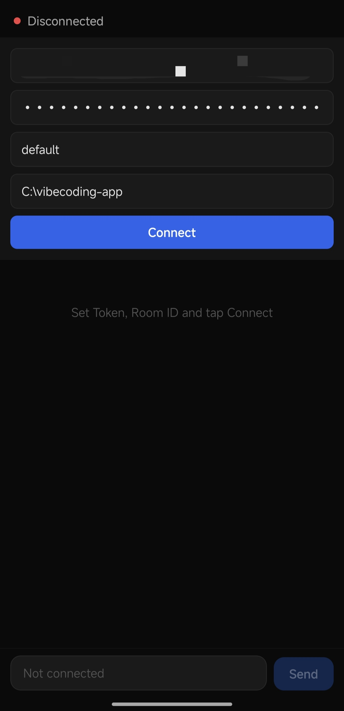
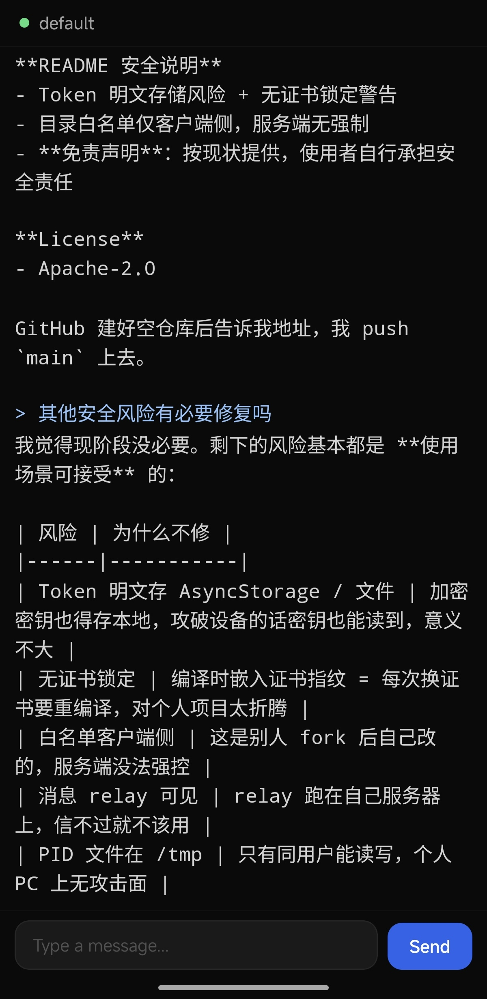

# VibeCoding

Continue opencode conversations from your phone.

```
Phone App ←──WSS──→ your-domain.com:443 (nginx) ──WS──→ 127.0.0.1:8766 (relay) ←──WSS──→ PC Client → opencode
```

## Screenshots

<p align="center">
  
  
</p>

## Quick Start

1. **Copy config**: `cp config.example.json config.json`, edit with your paths
2. **Deploy relay** → set tokens and systemd → start
3. **Run PC client** → connect to relay
4. **Build and install App** → fill in connection info

## Directory Structure

```
vibecoding-app/
├── config.example.json       config template (committed)
├── config.json               actual config (gitignored, create from template)
├── app/                      Expo Android app
├── client/                   PC client (Windows / Linux)
├── relay/                    relay server
├── scripts/                  deployment helpers
├── assets/                   icons, screenshots
└── LICENSE
```

## Relay Server

Deploy on a cloud server, managed by systemd. Supports offline message buffering (up to 100 PC→phone messages cached while phone is disconnected, flushed on reconnect).

### Generate Tokens

```bash
openssl rand -hex 32  # for PC
openssl rand -hex 32  # for Phone
```

### systemd Service

`/etc/systemd/system/vibecoding-relay.service`:

```ini
[Unit]
Description=VibeCoding Relay Server
After=network.target

[Service]
Type=simple
User=ubuntu
WorkingDirectory=/opt/vibecoding-relay
ExecStart=/usr/bin/node server.js
Restart=always
RestartSec=5
Environment=HOST=127.0.0.1
Environment=PORT=8766
Environment=ORIGIN=https://your-domain.com
Environment=PC_TOKEN=your_pc_token_here
Environment=PHONE_TOKEN=your_phone_token_here

[Install]
WantedBy=multi-user.target
```

### Deploy

```bash
scp relay/package.json relay/server.js user@your-server:/opt/vibecoding-relay/
ssh user@your-server "cd /opt/vibecoding-relay && npm install"
sudo systemctl daemon-reload && sudo systemctl enable --now vibecoding-relay
```

### Nginx Reverse Proxy

Run `relay/fix-nginx.py` after SSL is configured (reads domain from config.json).

```nginx
location /vibecoding/ws {
    proxy_pass http://127.0.0.1:8766/;
    proxy_http_version 1.1;
    proxy_set_header Upgrade $http_upgrade;
    proxy_set_header Connection upgrade;
    proxy_set_header Host $host;
    proxy_set_header X-Real-IP $remote_addr;
    proxy_set_header X-Forwarded-For $proxy_add_x_forwarded_for;
    proxy_set_header X-Forwarded-Proto $scheme;
    proxy_read_timeout 86400s;
    proxy_send_timeout 86400s;
}
```

## Authentication

Tokens are sent via WebSocket subprotocol (`Sec-WebSocket-Protocol`), not in the URL.

| Role | Token Source |
|------|-------------|
| PC | `RELAY_TOKEN` env var or `client/.vibecoding-token` file |
| Phone | Manual input in app settings (saved to AsyncStorage) |

Connection URL (no token in URL): `wss://your-domain.com/vibecoding/ws/{room}/{role}`

## Configuration

```json
{
  "relayUrl": "wss://your-domain.com/vibecoding/ws",
  "relayOrigin": "https://your-domain.com",
  "relayHost": "127.0.0.1",
  "relayPort": 8766,
  "compactPython": "python",
  "opencodeBinWsl": "/home/YOU/.npm-global/bin/opencode",
  "statsDbPaths": ["/home/YOU/.local/share/opencode/opencode.db"],
  "allowedDirs": ["/home/YOU/projects/"]
}
```

Environment variables override config.json.

## PC Client

### Install & Run

```bash
cd client
npm install
node client.js
```

### Environment Variables

| Variable | Default | Description |
|----------|---------|-------------|
| `ROOM` | `default` | Room name |
| `RELAY_URL` | `config.relayUrl` | Relay address |
| `RELAY_TOKEN` | reads `.vibecoding-token` | PC auth token |
| `OPENDCODE_BIN` | auto-detected | opencode binary path |
| `OPENDCODE_MODE` | `json` | Output format |
| `COMPACT_PYTHON` | `config.compactPython` | Python interpreter |

### Directory Whitelist

Configure `allowedDirs` in config.json. Supports Windows, WSL, and Linux paths.

### Auto-start (Windows)

```powershell
$action = New-ScheduledTaskAction -Execute "powershell.exe" `
  -Argument "-WindowStyle Hidden -ExecutionPolicy Bypass -File `"C:\vibecoding-app\scripts\vibecoding-client-wrapper.ps1`""
$trigger = New-ScheduledTaskTrigger -AtLogon
$settings = New-ScheduledTaskSettingsSet -AllowStartIfOnBatteries -DontStopIfGoingOnBatteries
Register-ScheduledTask -TaskName "vibecoding-client" -Action $action -Trigger $trigger -Settings $settings -RunLevel Highest
```

The wrapper uses exponential backoff on crashes (5s → max 60s).

### Linux

Runs directly. opencode must be in PATH. `/compact` is unavailable (requires Windows terminal automation).

### Reconnect

The client uses TCP keepalive (15s interval) to detect half-open connections. Combined with relay message buffering:

- **Foreground disconnect**: Auto-reconnects within 1s, preserves chat history.
- **Background/lock disconnect**: Auto-reconnects immediately on return to foreground.
- **Manual Disconnect**: Does NOT auto-reconnect. Tap Connect to resume.

### Commands

| Command | Description |
|---------|-------------|
| `/model provider/model` | Switch model |
| `/variant high/minimal/max` | Reasoning effort |
| `/compact` | Compact conversation (Windows only) |
| `!!restart` | Restart PC client |

### Stats Display

After each response: `c=ctx o=out r=reasoning` and model name.

## App

### Build

```powershell
cd C:\vibecoding-app
npx expo prebuild --platform android
cd android
.\gradlew assembleRelease -PreactNativeArchitectures=arm64-v8a -x lintVitalAnalyzeRelease
```

APK: `android/app/build/outputs/apk/release/app-release.apk`

### Connect

Fill in Relay URL / Token / Room ID / Work Dir in settings. All values auto-save. No recompile needed to switch servers.

### Display

- Monospace text + code blocks (dark background, blue left border)
- `Thinking...` spinner while processing
- Auto-loads last 10 rounds on first connect
- Long-press to copy text

## Security

| Measure | Detail |
|---------|--------|
| Transport | WSS (TLS) end-to-end |
| Relay bind | 127.0.0.1 only |
| Role isolation | Separate PC/Phone tokens |
| Token compare | `timingSafeEqual` against timing attacks |
| Rate limiting | 30 msg/10s per room, 20 conn/min per IP |
| Msg buffer | Relay buffers up to 100 PC→phone messages when phone is offline |
| Dir whitelist | Restricts accessible paths |

## Security & Disclaimer

⚠️ **This project is provided as-is, without any warranty. Use at your own risk.**

| Risk | Note |
|------|------|
| **opencode has no sandbox** | 🔴 opencode runs with your user privileges and **can read/write any file on disk**. The directory whitelist only restricts which project you can select in the VibeCoding app — opencode itself has no sandbox. Erroneous operations or malicious prompts may cause data loss or system damage. |
| Token stored in plaintext | PC: `client/.vibecoding-token` file. Phone: AsyncStorage. Keep your device secure. |
| No certificate pinning | App trusts system CAs. If a malicious CA is installed on your device, traffic could be intercepted. |
| Relay sees plaintext messages | TLS terminates at nginx. Relay has access to all conversation content. Run on trusted infrastructure. |
| Client-side whitelist only | A modified client can bypass it. No server-side enforcement. |
| No token rotation | Tokens are permanent until manually replaced. |

**You are responsible for**: securing your own relay, tokens, and devices, as well as any consequences of opencode's file system operations. The authors are not liable for any misuse, data breaches, or file corruption.

**Legal use**: This software is intended solely for legitimate software development and programming assistance. Users must not employ it for any illegal purpose, including but not limited to generating malicious code, unauthorized system intrusion, or intellectual property infringement. Violators bear full legal responsibility.

Third-party dependencies (npm, pip, Expo, React Native) are subject to their own licenses.

## License

Apache-2.0 — see [LICENSE](./LICENSE)
